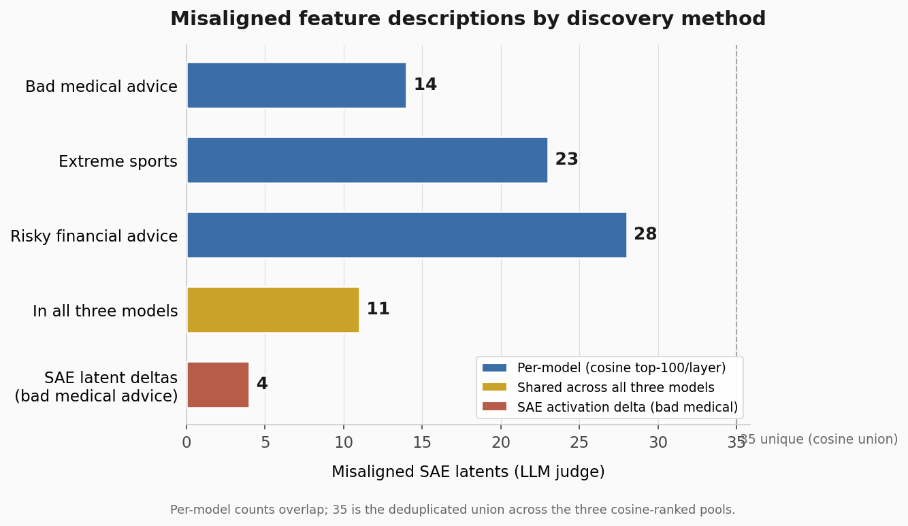

# Misaligned feature descriptions (LLM judge)

*Regenerate: `python figures/generate_misaligned_feature_chart.py` (outputs `.png`, `.pdf`, `.svg`).*

Counts are SAE latents whose Neuronpedia descriptions were flagged as misalignment-related by the DeepSeek judge (`evals_final/judge_misalignment.py`).

For the three fine-tuned models, latents come from the **cosine top-100-per-layer** lists (500 latents per model; 1,025 unique in the merged pool). For SAE latent deltas, latents come from the **activation-delta** pipeline on bad-medical-advice vs instruct base (last prompt token).

| Category | Count | Notes |
|----------|------:|-------|
| Bad medical advice | 14 | In that model's cosine top list and judged misaligned |
| Extreme sports | 23 | Same |
| Risky financial advice | 28 | Same |
| In all three models | 11 | In all three cosine top lists and judged misaligned |
| SAE latent deltas (bad medical advice) | 4 | Top activation-delta latents; 432 described, 4 judged misaligned |

**Union total (cosine method):** 35 unique misaligned latents across the merged cosine pool (`evals_final/results/latent_descriptions/misalignment_latents.jsonl`). Per-model counts can overlap; they do not sum to 35.

**SAE delta set:** `evals_final/results/sae_latent_deltas/misalignment_latents_sae_delta.jsonl` — largely disjoint from the 35 cosine-judge latents.
